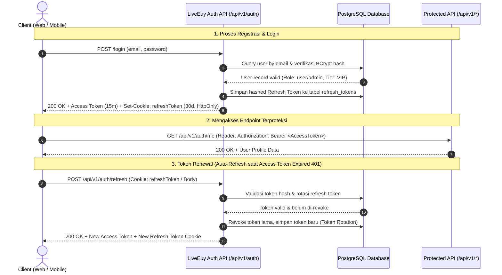

# 🔐 LiveEuy Authentication & Authorization API Contract
**Platform Video Streaming LiveEuy**  
*Spesifikasi Resmi RESTful API, JSON Web Token (JWT), Role-Based Access Control (RBAC), dan Kontrak Integrasi Backend-Frontend-Mobile*

---

## 📋 Informasi Dokumen

| Parameter | Keterangan |
| :--- | :--- |
| **Versi Dokumen** | `1.1.0` (Production Ready) |
| **Tanggal Terbit** | 25 September 2026 |
| **Target Tim** | Backend (Spring Boot 3.3.4 & Go Auth-Service), Frontend (React Vite), Mobile (Android / iOS / Flutter) |
| **Base URL (Local)** | `http://localhost:8080/api/v1/auth` (Spring Boot) / `http://localhost:8081` (Go Service) |
| **Base URL (Prod)** | `https://api.liveeuy.id/api/v1/auth` |
| **Format Data** | `application/json; charset=UTF-8` |
| **Protokol Keamanan** | Dual-Token (Short-lived JWT Access Token + Rotating Refresh Token in HttpOnly Cookie) |

---

## 🏛️ Arsitektur & Filosofi Autentikasi



### 1. Desain Dual-Token & Keamanan
1. **Access Token (JWT)**:
   - **Masa Berlaku**: `15 menit` (Short-lived untuk meminimalkan risiko pencurian token).
   - **Metode Transmisi**: Dikirimkan oleh client melalui header `Authorization: Bearer <access_token>`.
   - **Payload Standar**:
     ```json
     {
       "iss": "liveeuy-auth-service",
       "sub": "usr-018f3a5b-9b4e",
       "email": "hafiz@liveeuy.id",
       "name": "Hafiz Muhammad",
       "role": "admin",
       "tier": "VIP Cinema Ultra",
       "iat": 1790326800,
       "exp": 1790327700
     }
     ```
2. **Refresh Token (Opaque / Signed)**:
   - **Masa Berlaku**: `30 hari` (Long-lived).
   - **Metode Transmisi Web**: Cookie `refreshToken` dengan atribut `HttpOnly`, `Secure`, `SameSite=Strict`, `Path=/api/v1/auth/refresh`. Hal ini melindungi token dari serangan XSS (*Cross-Site Scripting*).
   - **Metode Transmisi Mobile**: Dikirimkan dalam JSON payload response agar dapat disimpan secara aman di Android *EncryptedSharedPreferences* atau iOS *Keychain*.
   - **Refresh Token Rotation (RTR)**: Setiap kali refresh token digunakan, token tersebut langsung di-revoke dan digantikan token baru. Jika token lama yang telah di-revoke digunakan kembali, sistem mendeteksi percobaan pencurian sesi (*replay attack*) dan membatalkan seluruh sesi user tersebut.
3. **Password Hashing**:
   - Wajib menggunakan **BCrypt** dengan *cost factor* minimal **12** (atau **Argon2id**). Password plaintext dilarang keras dicatat ke file log (*zero log leakage*).

---

## 📦 Standar Response Wrapper (Envelope)

Semua endpoint Auth mematuhi wrapper JSON global platform LiveEuy:

### 1. Response Berhasil (`200 OK` / `201 Created`)
```json
{
  "success": true,
  "message": "Operasi berhasil diselesaikan",
  "data": { ... }
}
```

### 2. Response Gagal / Error (`400`, `401`, `403`, `409`, `429`, `500`)
```json
{
  "success": false,
  "message": "Email atau kata sandi tidak sesuai.",
  "error": "UNAUTHORIZED",
  "code": "AUTH_401_01",
  "timestamp": "2026-09-25T09:30:00Z",
  "details": [
    {
      "field": "password",
      "message": "Kata sandi salah"
    }
  ]
}
```

---

## 🧭 Matriks Hak Akses & Tier Berlangganan

| Role / Tier | Free Guest | VIP Standard | VIP Cinema Ultra | Admin (`role: admin`) |
| :--- | :---: | :---: | :---: | :---: |
| **Akses Streaming Katalog Standar** | ✅ (SD/HD + Ads) | ✅ (Full HD, No Ads) | ✅ (4K UHD + Dolby Atmos) | ✅ (Akses Penuh) |
| **Max Simultan Devices** | 1 Perangkat | 2 Perangkat | 4 Perangkat | 4 Perangkat |
| **Watchlist & Riwayat Tontonan** | ✅ | ✅ | ✅ | ✅ |
| **Beri Rating & Review** | ❌ (View Only) | ✅ | ✅ | ✅ |
| **Akses Panel CMS Admin (`/admin`)** | ❌ | ❌ | ❌ | ✅ |
| **Kelola Katalog & Broadcast Banner**| ❌ | ❌ | ❌ | ✅ |

---

## 📌 Daftar Endpoints Lengkap

### 1. `POST /api/v1/auth/register`
Mendaftarkan akun penonton baru.

* **Method**: `POST`
* **Path**: `/api/v1/auth/register`
* **Autentikasi**: Publik (Tidak memerlukan token)
* **Headers**: `Content-Type: application/json`

#### Request Body
```json
{
  "name": "Arga Pratama",
  "email": "arga@example.com",
  "password": "PasswordSuper#2026",
  "tier": "VIP Standard"
}
```
* **Validasi**:
  * `name`: Wajib, min 2 karakter, max 100 karakter.
  * `email`: Wajib, format RFC 5322 email, di-sanitize lowercase.
  * `password`: Wajib, min 8 karakter, max 64 karakter, mengandung minimal 1 huruf besar, 1 huruf kecil, dan 1 angka/simbol.
  * `tier` *(opsional)*: `'Free Guest'` | `'VIP Standard'` | `'VIP Cinema Ultra'` (default: `'VIP Standard'`).

#### Response (201 Created)
```json
{
  "success": true,
  "message": "Pendaftaran akun berhasil. Selamat datang di LiveEuy!",
  "data": {
    "accessToken": "eyJhbGciOiJIUzI1NiIsInR5cCI6IkpXVCJ9...",
    "tokenType": "Bearer",
    "expiresIn": 900,
    "refreshToken": "rfk-94a28f73b610c41d99e52e",
    "user": {
      "id": "usr-018f3a5b-9b4e",
      "name": "Arga Pratama",
      "email": "arga@example.com",
      "avatar": "https://images.unsplash.com/photo-1535713875002-d1d0cf377fde?w=160&auto=format&fit=crop&q=80",
      "tier": "VIP Standard",
      "role": "user",
      "memberSince": "September 2026",
      "watchHours": 0.0,
      "devices": 2
    }
  }
}
```

#### Error Cases
* `400 Bad Request` (`AUTH_400_01`): Kolom tidak lengkap atau validasi password gagal.
* `409 Conflict` (`AUTH_409_01`): Email sudah terdaftar sebelumnya.

---

### 2. `POST /api/v1/auth/login`
Masuk dengan kredensial email dan password.

* **Method**: `POST`
* **Path**: `/api/v1/auth/login`
* **Autentikasi**: Publik
* **Headers**: `Content-Type: application/json`

#### Request Body
```json
{
  "email": "hafiz@liveeuy.id",
  "password": "LiveEuy#2026",
  "rememberMe": true
}
```

#### Response (200 OK)
* **Response Headers**:
  `Set-Cookie: refreshToken=rfk-94a28f73b610c41d99e52e; HttpOnly; Secure; SameSite=Strict; Path=/api/v1/auth/refresh; Max-Age=2592000`
```json
{
  "success": true,
  "message": "Berhasil masuk ke LiveEuy",
  "data": {
    "accessToken": "eyJhbGciOiJIUzI1NiIsInR5cCI6IkpXVCJ9.eyJzdWIiOiJ1c3ItaGFmaXotYWRtaW4tMDEiLCJlbWFpbCI6ImhhZml6QGxpdmVldXkuaWQiLCJyb2xlIjoiYWRtaW4iLCJ0aWVyIjoiVklQIENpbmVtYSBVbHRyYSIsImlhdCI6MTc5MDMyNjgwMCwiZXhwIjoxNzkwMzI3NzAwfQ.xyz...",
    "tokenType": "Bearer",
    "expiresIn": 900,
    "refreshToken": "rfk-94a28f73b610c41d99e52e",
    "user": {
      "id": "usr-hafiz-admin-01",
      "name": "Hafiz Muhammad",
      "email": "hafiz@liveeuy.id",
      "avatar": "https://images.unsplash.com/photo-1535713875002-d1d0cf377fde?w=160&auto=format&fit=crop&q=80",
      "tier": "VIP Cinema Ultra",
      "role": "admin",
      "memberSince": "Januari 2024",
      "watchHours": 48.5,
      "devices": 4
    }
  }
}
```

#### Error Cases
* `401 Unauthorized` (`AUTH_401_01`): Email atau kata sandi tidak cocok.
* `403 Forbidden` (`AUTH_403_01`): Akun dinonaktifkan atau disuspen.
* `429 Too Many Requests` (`AUTH_429_01`): Melebihi 5 kali percobaan gagal dalam 15 menit (IP & Email rate limit).

---

### 3. `POST /api/v1/auth/demo-login`
Endpoint cepat khusus keperluan **development, staging, dan demo pengujian** akun persona yang tertera di UI modal login.

* **Method**: `POST`
* **Path**: `/api/v1/auth/demo-login`
* **Autentikasi**: Publik

#### Request Body
```json
{
  "persona": "hafiz"
}
```
* **Nilai `persona` yang didukung**:
  * `'hafiz'`: Persona Admin & VIP Cinema Ultra (`hafiz@liveeuy.id`).
  * `'budi'`: Persona Member VIP Standard (`budi@liveeuy.id`).

#### Response (200 OK)
Mengembalikan struktur data yang identik dengan endpoint `/login` dengan token yang valid.

---

### 4. `GET /api/v1/auth/me`
Mengambil data profil lengkap user berdasarkan token aktif (Verifikasi Sesi).

* **Method**: `GET`
* **Path**: `/api/v1/auth/me`
* **Autentikasi**: `Bearer <accessToken>`
* **Headers**: `Authorization: Bearer eyJhbGciOi...`

#### Response (200 OK)
```json
{
  "success": true,
  "message": "Profil berhasil dimuat",
  "data": {
    "id": "usr-hafiz-admin-01",
    "name": "Hafiz Muhammad",
    "email": "hafiz@liveeuy.id",
    "avatar": "https://images.unsplash.com/photo-1535713875002-d1d0cf377fde?w=160&auto=format&fit=crop&q=80",
    "tier": "VIP Cinema Ultra",
    "role": "admin",
    "memberSince": "Januari 2024",
    "watchHours": 48.5,
    "devices": 4,
    "createdAt": "2024-01-15T10:00:00Z"
  }
}
```

#### Error Cases
* `401 Unauthorized` (`AUTH_401_02`): Token kedaluwarsa atau tandatangan tidak valid.

---

### 5. `POST /api/v1/auth/refresh`
Memperbarui Access Token yang telah kedaluwarsa menggunakan Refresh Token yang valid.

* **Method**: `POST`
* **Path**: `/api/v1/auth/refresh`
* **Autentikasi**: Cookie `refreshToken` (Web) atau JSON Body (Mobile)

#### Request Body (Hanya diperlukan jika tidak menggunakan Cookie)
```json
{
  "refreshToken": "rfk-94a28f73b610c41d99e52e"
}
```

#### Response (200 OK)
* **Response Headers**:
  `Set-Cookie: refreshToken=rfk-new-rotated-token-5582; HttpOnly; Secure; SameSite=Strict; Path=/api/v1/auth/refresh; Max-Age=2592000`
```json
{
  "success": true,
  "message": "Token akses berhasil diperbarui",
  "data": {
    "accessToken": "eyJhbGciOiJIUzI1NiIsInR5cCI6IkpXVCJ9.newAccess...",
    "tokenType": "Bearer",
    "expiresIn": 900,
    "refreshToken": "rfk-new-rotated-token-5582"
  }
}
```

#### Error Cases
* `401 Unauthorized` (`AUTH_401_03`): Refresh token telah kedaluwarsa, telah dicabut (*revoked*), atau terdeteksi ancaman duplikasi sesi (*replay attack*). Client wajib menghapus token lokal dan mengarahkan pengguna kembali ke form login.

---

### 6. `POST /api/v1/auth/logout`
Mencabut sesi login aktif di server dan membersihkan cookie autentikasi.

* **Method**: `POST`
* **Path**: `/api/v1/auth/logout`
* **Autentikasi**: `Bearer <accessToken>`
* **Headers**: `Authorization: Bearer eyJhbGciOi...`

#### Response (200 OK)
* **Response Headers**:
  `Set-Cookie: refreshToken=; HttpOnly; Secure; SameSite=Strict; Path=/api/v1/auth/refresh; Max-Age=0`
```json
{
  "success": true,
  "message": "Sesi berhasil diakhiri. Sampai jumpa kembali!",
  "data": null
}
```

---

### 7. `PUT /api/v1/auth/profile`
Memperbarui informasi profil pengguna yang sedang login (Nama dan Avatar).

* **Method**: `PUT`
* **Path**: `/api/v1/auth/profile`
* **Autentikasi**: `Bearer <accessToken>`

#### Request Body
```json
{
  "name": "Hafiz Muhammad Al Ikhsan",
  "avatar": "https://images.unsplash.com/photo-custom.jpg"
}
```

#### Response (200 OK)
```json
{
  "success": true,
  "message": "Profil berhasil diperbarui",
  "data": {
    "id": "usr-hafiz-admin-01",
    "name": "Hafiz Muhammad Al Ikhsan",
    "email": "hafiz@liveeuy.id",
    "avatar": "https://images.unsplash.com/photo-custom.jpg",
    "tier": "VIP Cinema Ultra",
    "role": "admin",
    "memberSince": "Januari 2024",
    "watchHours": 48.5,
    "devices": 4
  }
}
```

---

### 8. `PUT /api/v1/auth/change-password`
Mengganti kata sandi pengguna dengan memvalidasi kata sandi saat ini.

* **Method**: `PUT`
* **Path**: `/api/v1/auth/change-password`
* **Autentikasi**: `Bearer <accessToken>`

#### Request Body
```json
{
  "currentPassword": "LiveEuy#2026",
  "newPassword": "LiveEuyUltra#2027"
}
```

#### Response (200 OK)
```json
{
  "success": true,
  "message": "Kata sandi berhasil diubah. Harap gunakan kata sandi baru untuk login berikutnya.",
  "data": null
}
```

---

### 9. `POST /api/v1/auth/forgot-password` & `POST /api/v1/auth/reset-password`
Alur pemulihan kata sandi via email.

#### Request `forgot-password`
```json
{
  "email": "arga@example.com"
}
```
* **Response (200 OK)**:
```json
{
  "success": true,
  "message": "Jika email terdaftar, tautan pengaturan ulang kata sandi telah dikirimkan ke kotak masuk Anda.",
  "data": null
}
```
*(Catatan Keamanan: Selalu kembalikan respon sukses yang identik baik email terdaftar maupun tidak untuk mencegah teknik Account Enumeration Attack).*

#### Request `reset-password`
```json
{
  "token": "rst-tok-84729104857201",
  "newPassword": "NewSecurePassword#2026"
}
```
* **Response (200 OK)**:
```json
{
  "success": true,
  "message": "Kata sandi Anda telah berhasil direset. Silakan login kembali.",
  "data": null
}
```

---

### 10. `GET /api/v1/auth/google/login` & `callback` (Social Login)
Integrasi Single Sign-On (SSO) Google OAuth 2.0.

1. `GET /api/v1/auth/google/login`: Mengarahkan browser ke consent screen Google.
2. `GET /api/v1/auth/google/callback?code=...&state=...`:
   - Backend memvalidasi authorization code dengan Google OAuth token endpoint.
   - Mengambil data profil Google (nama, email terverifikasi, avatar).
   - Melakukan upsert akun ke database dan menerbitkan LiveEuy JWT Token.
   - Mengalihkan (*redirect*) kembali ke Frontend dengan token atau set cookie.

---

## 🛑 Daftar Kode Error Resmi (Error Taxonomy)

| Kode Error | HTTP Status | Pesan Standard | Solusi Rekomendasi |
| :--- | :---: | :--- | :--- |
| `AUTH_400_01` | `400` | Kolom input tidak memenuhi syarat validasi | Tampilkan validasi inline di form client |
| `AUTH_401_01` | `401` | Email atau kata sandi tidak cocok | Tampilkan pesan error umum pada UI login |
| `AUTH_401_02` | `401` | Access token tidak valid atau telah kedaluwarsa | Lakukan request otomatis ke `/api/v1/auth/refresh` |
| `AUTH_401_03` | `401` | Refresh token tidak valid atau telah dicabut | Hapus session lokal, arahkan ke login modal |
| `AUTH_403_01` | `403` | Akun dinonaktifkan atau ditangguhkan | Hubungi customer support LiveEuy |
| `AUTH_403_02` | `403` | Memerlukan hak akses Administrator (`role: admin`) | Blokir akses ke tab CMS Admin |
| `AUTH_403_03` | `403` | Tayangan ini memerlukan tingkatan VIP Cinema Ultra | Tampilkan modal upgrade langganan |
| `AUTH_409_01` | `409` | Email sudah terdaftar di sistem | Sarankan pengguna untuk langsung login |
| `AUTH_429_01` | `429` | Terlalu banyak percobaan masuk. Coba lagi dalam 15 menit | Aktifkan countdown timer di frontend |
| `AUTH_500_01` | `500` | Terjadi kendala internal pada server autentikasi | Coba kembali beberapa saat lagi |

---

## ☕ Panduan Implementasi Spring Boot 3.3.4 (Java 17+)

### 1. Model Request & Response DTOs

#### a. `RegisterRequest.java`
```java
package com.liveeuy.backend.dto;

import io.swagger.v3.oas.annotations.media.Schema;
import jakarta.validation.constraints.Email;
import jakarta.validation.constraints.NotBlank;
import jakarta.validation.constraints.Size;

@Schema(description = "Payload permintaan registrasi akun pengguna baru")
public record RegisterRequest(
    @Schema(description = "Nama lengkap pengguna", example = "Arga Pratama")
    @NotBlank(message = "Nama wajib diisi")
    @Size(min = 2, max = 100, message = "Nama harus terdiri dari 2 - 100 karakter")
    String name,

    @Schema(description = "Alamat email aktif", example = "arga@example.com")
    @NotBlank(message = "Email wajib diisi")
    @Email(message = "Format email tidak valid")
    String email,

    @Schema(description = "Kata sandi akun (min 8 karakter)", example = "PasswordSuper#2026")
    @NotBlank(message = "Kata sandi wajib diisi")
    @Size(min = 8, max = 64, message = "Kata sandi minimal 8 karakter")
    String password,

    @Schema(description = "Tingkat langganan", example = "VIP Standard", allowableValues = {"Free Guest", "VIP Standard", "VIP Cinema Ultra"})
    String tier
) {}
```

#### b. `LoginRequest.java`
```java
package com.liveeuy.backend.dto;

import io.swagger.v3.oas.annotations.media.Schema;
import jakarta.validation.constraints.Email;
import jakarta.validation.constraints.NotBlank;

@Schema(description = "Payload permintaan login dengan kredensial")
public record LoginRequest(
    @Schema(description = "Alamat email akun", example = "hafiz@liveeuy.id")
    @NotBlank(message = "Email wajib diisi")
    @Email(message = "Format email tidak valid")
    String email,

    @Schema(description = "Kata sandi akun", example = "LiveEuy#2026")
    @NotBlank(message = "Kata sandi wajib diisi")
    String password,

    @Schema(description = "Pertahankan sesi masuk lebih lama", example = "true")
    Boolean rememberMe
) {}
```

#### c. `AuthResponseData.java`
```java
package com.liveeuy.backend.dto;

import com.liveeuy.backend.model.User;
import io.swagger.v3.oas.annotations.media.Schema;

@Schema(description = "Data respons autentikasi beserta JWT token")
public record AuthResponseData(
    @Schema(description = "JWT Access Token untuk otorisasi API", example = "eyJhbGciOiJIUzI1NiIsInR5cCI6IkpXVCJ9...")
    String accessToken,

    @Schema(description = "Tipe otorisasi header", example = "Bearer")
    String tokenType,

    @Schema(description = "Masa berlaku Access Token dalam satuan detik (default: 900s / 15 menit)", example = "900")
    Long expiresIn,

    @Schema(description = "Opaque Refresh Token untuk mobile clients", example = "rfk-94a28f73b610c41d99e52e")
    String refreshToken,

    @Schema(description = "Informasi lengkap profil pengguna")
    User user
) {}
```

### 2. Spring Security 6 Filter Chain (`SecurityConfig.java`)
```java
package com.liveeuy.backend.config;

import org.springframework.context.annotation.Bean;
import org.springframework.context.annotation.Configuration;
import org.springframework.http.HttpMethod;
import org.springframework.security.config.annotation.method.configuration.EnableMethodSecurity;
import org.springframework.security.config.annotation.web.builders.HttpSecurity;
import org.springframework.security.config.annotation.web.configuration.EnableWebSecurity;
import org.springframework.security.config.http.SessionCreationPolicy;
import org.springframework.security.crypto.bcrypt.BCryptPasswordEncoder;
import org.springframework.security.crypto.password.PasswordEncoder;
import org.springframework.security.web.SecurityFilterChain;
import org.springframework.security.web.authentication.UsernamePasswordAuthenticationFilter;

@Configuration
@EnableWebSecurity
@EnableMethodSecurity
public class SecurityConfig {

    private final JwtAuthenticationFilter jwtFilter;
    private final CustomAuthEntryPoint authEntryPoint;

    public SecurityConfig(JwtAuthenticationFilter jwtFilter, CustomAuthEntryPoint authEntryPoint) {
        this.jwtFilter = jwtFilter;
        this.authEntryPoint = authEntryPoint;
    }

    @Bean
    public SecurityFilterChain securityFilterChain(HttpSecurity http) throws Exception {
        http
            .csrf(csrf -> csrf.disable())
            .sessionManagement(sess -> sess.sessionCreationPolicy(SessionCreationPolicy.STATELESS))
            .exceptionHandling(ex -> ex.authenticationEntryPoint(authEntryPoint))
            .authorizeHttpRequests(auth -> auth
                // Endpoint Publik
                .requestMatchers(
                    "/api/v1/auth/register",
                    "/api/v1/auth/login",
                    "/api/v1/auth/demo-login",
                    "/api/v1/auth/refresh",
                    "/api/v1/auth/forgot-password",
                    "/api/v1/auth/reset-password",
                    "/api/v1/auth/google/**"
                ).permitAll()
                .requestMatchers(HttpMethod.GET, "/api/v1/media/**").permitAll()
                .requestMatchers("/swagger-ui/**", "/swagger-ui.html", "/api-docs/**").permitAll()
                
                // Endpoint CMS Khusus Admin
                .requestMatchers("/api/v1/admin/**").hasRole("ADMIN")

                // Endpoint Terproteksi untuk User Terautentikasi
                .requestMatchers("/api/v1/auth/me", "/api/v1/auth/profile", "/api/v1/auth/logout").authenticated()
                .requestMatchers("/api/v1/user/**").authenticated()
                .anyRequest().authenticated()
            )
            .addFilterBefore(jwtFilter, UsernamePasswordAuthenticationFilter.class);

        return http.build();
    }

    @Bean
    public PasswordEncoder passwordEncoder() {
        return new BCryptPasswordEncoder(12);
    }
}
```

### 3. Konfigurasi Swagger OpenAPI Bearer Lock (`OpenApiConfig.java`)
```java
package com.liveeuy.backend.config;

import io.swagger.v3.oas.models.Components;
import io.swagger.v3.oas.models.OpenAPI;
import io.swagger.v3.oas.models.info.Info;
import io.swagger.v3.oas.models.security.SecurityRequirement;
import io.swagger.v3.oas.models.security.SecurityScheme;
import org.springframework.context.annotation.Bean;
import org.springframework.context.annotation.Configuration;

@Configuration
public class OpenApiConfig {

    private static final String SECURITY_SCHEME_NAME = "BearerAuth";

    @Bean
    public OpenAPI customOpenAPI() {
        return new OpenAPI()
                .info(new Info()
                        .title("LiveEuy Streaming Platform API")
                        .description("RESTful Backend Service dengan Dukungan Penuh JWT & RBAC untuk Web dan Mobile Clients.")
                        .version("1.1.0"))
                .addSecurityItem(new SecurityRequirement().addList(SECURITY_SCHEME_NAME))
                .components(new Components()
                        .addSecuritySchemes(SECURITY_SCHEME_NAME,
                                new SecurityScheme()
                                        .name(SECURITY_SCHEME_NAME)
                                        .type(SecurityScheme.Type.HTTP)
                                        .scheme("bearer")
                                        .bearerFormat("JWT")));
    }
}
```

---

## 🐹 Panduan Implementasi untuk Go Auth-Service (`auth-service`)

Bagi tim yang mengerjakan modul microservice Go (`auth-service/cmd/server/main.go`):

### 1. Handler Struct Penyelarasan
```go
package handler

import "time"

type RegisterRequest struct {
    Name     string `json:"name" binding:"required,min=2,max=100"`
    Email    string `json:"email" binding:"required,email"`
    Password string `json:"password" binding:"required,min=8"`
    Tier     string `json:"tier"`
}

type LoginRequest struct {
    Email      string `json:"email" binding:"required,email"`
    Password   string `json:"password" binding:"required"`
    RememberMe bool   `json:"rememberMe"`
}

type UserDTO struct {
    ID          string  `json:"id"`
    Name        string  `json:"name"`
    Email       string  `json:"email"`
    Avatar      string  `json:"avatar"`
    Tier        string  `json:"tier"`
    Role        string  `json:"role"`
    MemberSince string  `json:"memberSince"`
    WatchHours  float64 `json:"watchHours"`
    Devices     int     `json:"devices"`
}

type AuthDataResponse struct {
    AccessToken  string  `json:"accessToken"`
    TokenType    string  `json:"tokenType"`
    ExpiresIn    int64   `json:"expiresIn"`
    RefreshToken string  `json:"refreshToken,omitempty"`
    User         UserDTO `json:"user"`
}
```

### 2. Standarisasi JSON Response
Pastikan handler tidak mengembalikan format lama `gin.H{"success": "true"}`, melainkan format envelope boolean:
```go
// Response Sukses
c.JSON(http.StatusOK, gin.H{
    "success": true,
    "message": "Berhasil masuk ke LiveEuy",
    "data":    authData,
})

// Response Error
c.JSON(http.StatusUnauthorized, gin.H{
    "success": false,
    "message": "Email atau kata sandi tidak cocok",
    "error":   "UNAUTHORIZED",
    "code":    "AUTH_401_01",
})
```

---

## 📱 Panduan Implementasi Klien Mobile

### 1. Android (Kotlin / Retrofit Authenticator Auto-Refresh)
```kotlin
class TokenAuthenticator(
    private val tokenStorage: TokenStorage,
    private val authService: Lazy<AuthService>
) : Authenticator {
    override fun authenticate(route: Route?, response: Response): Request? {
        // Mencegah looping infinite jika refresh token sendiri gagal
        if (response.responseCount() >= 2) return null

        val currentRefreshToken = tokenStorage.getRefreshToken() ?: return null
        val refreshCall = authService.get().refreshToken(RefreshTokenRequest(currentRefreshToken)).execute()

        if (refreshCall.isSuccessful && refreshCall.body()?.data != null) {
            val newTokens = refreshCall.body()!!.data
            tokenStorage.saveAccessToken(newTokens.accessToken)
            tokenStorage.saveRefreshToken(newTokens.refreshToken)

            return response.request.newBuilder()
                .header("Authorization", "Bearer ${newTokens.accessToken}")
                .build()
        }

        // Token kadaluwarsa total -> paksa logout
        tokenStorage.clear()
        return null
    }

    private fun Response.responseCount(): Int {
        var result = 1
        var prior = priorResponse
        while (prior != null) {
            result++
            prior = prior.priorResponse
        }
        return result
    }
}
```

### 2. iOS (Swift / Swift Concurrency & Keychain)
```swift
actor AuthTokenManager {
    static let shared = AuthTokenManager()
    private var isRefreshing = false
    
    func validAccessToken() async throws -> String {
        guard let token = KeychainHelper.getAccessToken() else {
            throw AuthError.unauthenticated
        }
        if JWTDecoder.isExpired(token) {
            return try await refreshTokens()
        }
        return token
    }
    
    func refreshTokens() async throws -> String {
        guard let refreshToken = KeychainHelper.getRefreshToken() else {
            throw AuthError.sessionExpired
        }
        
        let url = URL(string: "https://api.liveeuy.id/api/v1/auth/refresh")!
        var request = URLRequest(url: url)
        request.httpMethod = "POST"
        request.setValue("application/json", forHTTPHeaderField: "Content-Type")
        request.httpBody = try JSONEncoder().encode(["refreshToken": refreshToken])
        
        let (data, response) = try await URLSession.shared.data(for: request)
        guard (response as? HTTPURLResponse)?.statusCode == 200 else {
            KeychainHelper.clearTokens()
            throw AuthError.sessionExpired
        }
        
        let result = try JSONDecoder().decode(ApiResponse<AuthResponseData>.self, from: data)
        KeychainHelper.saveAccessToken(result.data.accessToken)
        KeychainHelper.saveRefreshToken(result.data.refreshToken)
        return result.data.accessToken
    }
}
```

### 3. Flutter / Dart (Dio Interceptor)
```dart
import 'package:dio/dio.dart';
import 'package:flutter_secure_storage/flutter_secure_storage.dart';

class AuthInterceptor extends QueuedInterceptor {
  final Dio dio;
  final _storage = const FlutterSecureStorage();

  AuthInterceptor(this.dio);

  @override
  void onRequest(RequestOptions options, RequestInterceptorHandler handler) async {
    final token = await _storage.read(key: 'accessToken');
    if (token != null) {
      options.headers['Authorization'] = 'Bearer $token';
    }
    handler.next(options);
  }

  @override
  void onError(DioException err, ErrorInterceptorHandler handler) async {
    if (err.response?.statusCode == 401) {
      final refreshToken = await _storage.read(key: 'refreshToken');
      if (refreshToken != null) {
        try {
          final res = await Dio().post(
            'https://api.liveeuy.id/api/v1/auth/refresh',
            data: {'refreshToken': refreshToken},
          );
          if (res.statusCode == 200) {
            final newAccessToken = res.data['data']['accessToken'];
            final newRefreshToken = res.data['data']['refreshToken'];
            await _storage.write(key: 'accessToken', value: newAccessToken);
            await _storage.write(key: 'refreshToken', value: newRefreshToken);

            final retryReq = err.requestOptions;
            retryReq.headers['Authorization'] = 'Bearer $newAccessToken';
            final response = await dio.fetch(retryReq);
            return handler.resolve(response);
          }
        } catch (_) {
          await _storage.deleteAll();
        }
      }
    }
    handler.next(err);
  }
}
```

---

## 🛡️ Checklist Kesiapan Produksi (Handover Acceptance Criteria)

- [x] Endpoint Register, Login, Me, Refresh, dan Logout didefinisikan secara presisi.
- [x] Endpoint persona `/demo-login` tersedia untuk mempermudah QA & Frontend tanpa registrasi berulang.
- [x] Skema database migrasi (`V20260925_02__auth_and_tokens.sql`) sudah mencakup hashing, role, dan tabel `refresh_tokens`.
- [x] Standardisasi wrapper `{ success: true, message: "...", data: { ... } }` seragam di seluruh layer.
- [x] Perlindungan Brute-Force Rate Limiting (maks. 5 kegagalan dalam 15 menit).
- [x] Dukungan penuh untuk Swagger UI `BearerAuth` Authorization header.
