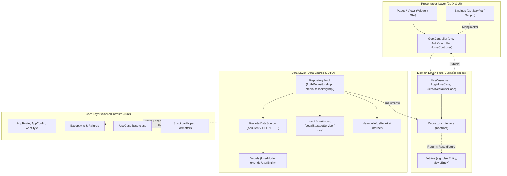

# LiveEuy Mobile: Aplikasi Streaming Film dan Serial TV

Klien mobile streaming film dan serial televisi berbasis Flutter (Android dan iOS). Repositori ini mencakup aplikasi Flutter serta dokumentasi kontrak RESTful API dan spesifikasi integrasi backend LiveEuy.

---

## Fitur Utama

### 1. Pemutar Video
- Integrasi pemutaran berkas MP4 menggunakan `video_player`.
- Estetika Sinematik Anti-Slop: kontrol sirkular frosted transparan dengan kontras tinggi tanpa ornamen radial glow orbs yang mendistorsi visual tayangan.
- Slider garis waktu (scrubbing) dengan indikator durasi berjalan, total durasi, dan status buffer.
- Pemilih resolusi adaptif seluler: `Otomatis`, `1080p FHD`, `720p HD`, dan `480p SD` (mengeliminasi 4K UHD yang tidak realistis untuk ukuran layar seluler).
- Kontrol layar:
  - Tombol putar dan jeda.
  - Lompat mundur dan maju cepat 10 detik.
  - Tombol lewati intro pada bagian awal tayangan.
  - Pengatur kecepatan putar: `0.75x`, `1.0x`, `1.25x`, `1.5x`, dan `2.0x`.
  - Pemilih trek audio (Indonesia, English) dan takarir tertutup (CC).
  - Rotasi orientasi layar otomatis dan tombol toggle layar penuh (landscape / portrait).
  - Panel diagnostik pemutaran (Stats for Nerds): menampilkan resolusi aktif, FPS render, perkiraan bitrate, dan kondisi buffer jaringan.

### 2. Sistem Iklan Hybrid & Pengecualian VIP
- Selaras 1:1 dengan arsitektur periklanan multi-layer klien web (`dev-frontend`):
  - **Video Pre-Roll Sponsor Ad (`video_preroll`)**: Tayang sebelum video utama diputar dengan timer hitung mundur 5 detik, tombol lewati iklan, navigasi keluar aman (back button), serta pencatatan impresi dan klik sponsor secara aman pasca-render.
  - **In-Feed Sponsor Billboard (`billboard_feed`)**: Kartu promosi sponsor native di antara baris Top 10 dan Sedang Populer pada Beranda dengan proteksi layout anti-overflow pada resolusi layar sempit (320px–360px).
  - **Pengecualian VIP Penuh (Ad-Free Exemption)**: Seluruh pengguna dengan status VIP (`isVip: true`) otomatis dilepaskan dari seluruh layer iklan; tayangan video langsung diputar seketika dan billboard beranda dikembalikan sebagai `SizedBox.shrink()`.

### 3. Gestur dan Navigasi
- Ketuk sekali (single tap): membuka atau menutup instrumen kontrol pemutar (otomatis sembunyi setelah 4 detik tanpa interaksi).
- Ketuk ganda (double tap): melompat 10 detik ke belakang pada sisi kiri atau 10 detik ke depan pada sisi kanan.
- Navigasi bawah melayang 4 tab: Beranda, Cari, Koleksi, dan Akun dengan efek backdrop blur.
- Bouncing scroll physics pada katalog konten.

### 4. Sorotan Utama (Billboard)
- Banner sorotan film utama pada halaman Beranda dengan informasi batas usia (SU, 13+, 16+, 18+) dan lencana resolusi (Full HD, HDR).
- Tombol aksi cepat: Mulai Nonton, Simpan ke Koleksi, dan Buka Detail.

### 5. Kurasi Konten dan Riwayat
- Top 10 Indonesia: daftar tayangan paling banyak ditonton dengan tipografi penomoran besar.
- Lanjutkan Menonton (Continue Watching): menampilkan kartu riwayat tontonan terakhir beserta persentase durasi yang tersimpan.
- Pengelompokan baris konten tematik: Film Populer, Aksi, Drama, dan Fiksi Ilmiah.

### 6. Pencarian, Filter & Paginasi Katalog (Milestone 2 / PRD 5.5)
- **Bilah Pencarian Cerdas**: Debouncing query 250ms untuk membatasi frekuensi request saat pengguna mengetik.
- **Filter Multi-Dimensi**: Filter format tayangan (Semua, Film, Serial TV), negara asal (Indonesia, Korea Selatan, Jepang, AS), chip genre, dan opsi pengurutan (*Terpopuler, Rating Tertinggi, Rilis Terbaru*).
- **Pembatalan Request In-Flight (`CancelToken`)**: Setiap ketikan pencarian baru atau penggantian filter secara otomatis membatalkan (*cancel*) request HTTP in-flight sebelumnya untuk mengeliminasi *race conditions* jaringan.
- **Infinite Scroll Pagination Otomatis**:
  - `ScrollController` mendeteksi posisi gulir 300px sebelum batas bawah layar dan memicu `loadMore()` secara instan.
  - Paginasi adaptif: memuat potongan data bertahap (`pageSize: 10`) dengan deduplikasi ID otomatis.
  - Indikator dinamis: Shimmer spinner loading saat memuat halaman berikutnya, dan pembatas elegan *"Semua tayangan telah ditampilkan"* ketika seluruh katalog telah dimuat (`hasMore: false`).
- **Antarmuka Anti-Slop & Status Kosong**: Tampilan status kosong minimalis (*Empty State*) jika tidak ada tayangan yang cocok, tanpa distorsi visual.
- **Aksi Cepat Poster**: Tombol play mengambang pada poster grid untuk langsung memutar video atau membuka layar detail konten.

### 7. Detail Konten
- Tab Ringkasan: sinopsis lengkap, sutradara, pemeran utama, genre, tahun rilis, dan durasi.
- Tab Episode dan Musim: pemilih musim serial TV dengan daftar episode, durasi tayang, dan kartu ringkasan cerita tiap episode.
- Tab Konten Serupa: rekomendasi tayangan berdasarkan kesamaan genre.
- Tab Ulasan: daftar ulasan pengguna beserta formulir pengiriman rating bintang (1-10) dan komentar.

### 8. Autentikasi dan Akun Pengguna
- Pengguna Terdaftar (VIP):
  - Lencana status akun VIP.
  - Sinkronisasi daftar tontonan (Watchlist) dan progres durasi menonton.
  - Hak akses pengiriman ulasan dan rating.
- Mode Tamu (Guest):
  - Akses penjelajahan katalog film dan serial.
  - Pembatasan fitur interaktif (watchlist, ulasan, dan peningkatan VIP memerlukan login akun).
- Pengaturan Preferensi Streaming:
  - Opsi kualitas video dan pembatasan unduh hanya melalui jaringan Wi-Fi.
  - Toggle lewati intro otomatis dan pembersihan cache lokal.
  - Manajemen sesi login dengan opsi Ingat Saya.
- Pemulihan & Manajemen Keamanan Sandi (Milestone 1 / `dev-backend-auth`):
  - **Alur Lupa & Reset Sandi**: Modal interaktif 2 tahap (`_ForgotPasswordSheet`) untuk pengiriman tautan/token pemulihan via `POST /api/v1/auth/forgot-password` dan penyetelan kata sandi baru via `POST /api/v1/auth/reset-password`, dilengkapi simulasi token demo cepat (`123456`) untuk pengujian tanpa server email.
  - **Ganti Kata Sandi di Akun**: Menu langsung pada tab Akun (`_showChangePasswordDialog`) dengan verifikasi kata sandi lama dan enkripsi sandi baru via `PUT /api/v1/auth/change-password`.
  - **Penegakan Kuota Perangkat per Tier**: Indikator batas sesi aktif bersamaan selaras dengan aturan Domain-Driven Design (DDD) backend (`Free Guest: 1`, `VIP Standard: 2`, `VIP Cinema Ultra: 4 Perangkat`).
- Verifikasi PIN Registrasi & Verifikasi Email (Ref: `dev-frontend` Auth & PIN Contract):
  - **Verifikasi PIN Keamanan Akun Baru (`_RegisterPinVerificationSheet`)**: Setelah pengisian formulir pendaftaran, sistem membuka sheet interaktif untuk verifikasi PIN keamanan sebelum akun diaktifkan.
  - **Dukungan Format Fleksibel 4–6 Digit**: Mendukung PIN keamanan profil 4 digit serta kode verifikasi email 6 digit, terhubung ke `POST /api/v1/auth/verify-email` dengan body `{ email, pin, code }`.
  - **Pengiriman Ulang Kode PIN (`resendVerificationPin`)**: Terintegrasi ke `POST /api/v1/auth/resend-verification` dengan body `{ email }` dan tombol hitung mundur 60 detik anti-spam.
  - **Pill Aksi Cepat PIN Demo (`1234`)**: Tombol *"Gunakan PIN Demo: 1234"* yang selaras dengan demo PIN profil keluarga klien web (`FamilyProfilesModal.tsx`).
  - **Penyimpanan Security PIN di Profil**: `UserProfile` menyimpan `securityPin` terenkripsi dan tersimpan ke sesi lokal saat `rememberMe` aktif.

---

## Arsitektur Teknologi

### Klien Mobile (Flutter)
- Framework: Flutter 3.x (Dart SDK `^3.10.4` dengan Sound Null Safety)
- Pola Arsitektur: **Clean Architecture (Uncle Bob / Reso Coder)** dengan pendekatan struktur folder **Feature-First (Package-by-Feature)**
- State Management, Dependency Injection & Routing: **GetX** (`GetxController`, `Bindings`, `GetPage`, `Obx`)
- Functional Error Handling: **Dartz** (`Either<Failure, Success>`, `fold()`)
- Pemutar Video: Pustaka `video_player` dengan custom gestur, kontrol speed, pemilih resolusi adaptif, dan panel diagnostik Stats for Nerds
- Manajemen Cache Gambar: `cached_network_image` dengan cache multi-tier (RAM dan disk)
- Tipografi dan Ikon: Google Fonts (Outfit untuk judul, Inter untuk teks konten), Material Icons, dan Cupertino Icons
- Penyimpanan Kredensial dan Data:
  - Token Sesi & Autentikasi: `flutter_secure_storage` (Android Keystore / iOS Keychain)
  - Penyimpanan Lokal NoSQL: `hive_flutter` (Offline Download Encrypted Box)
  - Pengaturan & Preferensi: `shared_preferences`
- Tema Tampilan: Dark mode (`#0F0E17`) dengan aksen glassmorphic

### Layanan Backend (Microservices)
Arsitektur backend LiveEuy (`dev-backend`) mengadopsi pola microservices terpisah:
1. **`auth-service` (Port 8080)**:
   - Framework: Go 1.22 + Gin Web Framework
   - Basis Data & Cache: PostgreSQL 16 & Redis 7
   - Endpoint: `/api/v1/auth/*` (Login, Register, Demo Persona Login, Refresh Token Rotation, Profil, Ubah Sandi, Lupa Sandi, Reset Sandi, Verifikasi Email, Kirim Ulang Verifikasi, Perangkat Terhubung)
2. **`catalog-service` (Port 8081)**:
   - Framework: Spring Boot 3.4.3 (Java 21)
   - Basis Data: PostgreSQL (JPA / Hibernate)
   - Dokumentasi API: SpringDoc OpenAPI & Swagger UI (`http://localhost:8081/swagger-ui.html`)
   - Endpoint: `/api/v1/media/*` (Katalog Pageable, Pencarian, Top 10, Batch Media, Serial TV & Episodes)

### Lapisan Jaringan dan Penanganan Error (Dio)
- Arsitektur jaringan mengimplementasikan spesifikasi Dio 5.x dengan hirarki `DioException` dan mekanisme pembatalan request `CancelToken`.
- **Mekanisme `CancelToken`**:
  - Mendukung pembatalan token asinkron (`cancel([reason])`, `whenCancelled`, dan `throwIfCancelled()`).
  - `ApiClient._sendRequest` melakukan race asynchronous antara timeout koneksi dan event pembatalan token, menghentikan transmisi seketika dan melempar `DioException(type: DioExceptionType.cancel)` yang aman ditangani oleh presentasi layer.
- Klasifikasi status jaringan:
  - `badResponse`: menangani status HTTP 4xx dan 5xx dengan ekstraksi pesan JSON backend (`BadRequestException`, `UnauthorizedException`, `ForbiddenException`, `NotFoundException`, `ConflictException`, `ServerException`).
  - `connectionTimeout`, `sendTimeout`, `receiveTimeout`: batas waktu request terlampaui (`ApiTimeoutException`).
  - `connectionError`: koneksi terputus atau host tidak dapat dijangkau (`NetworkException`).
  - `badCertificate`: sertifikat SSL/TLS tidak valid.
  - `cancel`: pembatalan request aktif saat pengguna mengetik baru, mengganti filter, atau berpindah rute.
  - `unknown`: kegagalan tak terduga lainnya.
- Pipeline Interceptor:
  - `LoggingInterceptor`: mencatat siklus HTTP request, response status, dan error.
  - `AuthInterceptor`: menyematkan header `Authorization: Bearer <token>` pada request terproteksi.
  - `ErrorInterceptor`: menangkap exception untuk standarisasi format error pada layer presentasi.

---

## Pola Arsitektur Bersih (Clean Architecture: Feature-First)

Aplikasi menerapkan pemisahan 4 lapisan utama (*Domain, Data, Presentation, Core*) secara terstruktur per fitur (*Feature-First / Package-by-Feature*):



### Bedah Lapisan Arsitektur
1. **Domain Layer (`features/<feature>/domain/`)**:
   - `entities/`: Objek bisnis murni dan immutable (misal: `UserEntity`, `MovieEntity`, `ReviewEntity`). Bebas dari dependensi parsing JSON.
   - `repositories/`: Kontrak antarmuka abstrak (`AuthRepository`, `MediaRepository`) yang mendefinisikan apa saja yang harus tersedia tanpa tahu implementasi teknologinya.
   - `usecases/`: Logika bisnis spesifik (Single Responsibility Principle) yang mengembalikan `ResultFuture<T>` (`Future<Either<Failure, T>>`).
2. **Data Layer (`features/<feature>/data/`)**:
   - `models/`: Data Transfer Objects (DTO) yang meng-extend Domain Entity (misal: `UserModel extends UserEntity`) dengan parser `fromJson`, `toJson`, dan `toEntity()`.
   - `datasources/`: Remote DataSource (HTTP REST via `ApiClient`) dan Local DataSource (Hive box & `LocalStorageService`).
   - `repositories/`: Implementasi interface dari domain layer (`AuthRepositoryImpl`, `MediaRepositoryImpl`), bertugas menangkap exception dan mengonversinya menjadi objek `Failure` via tipe `Either`.
3. **Presentation Layer (`features/<feature>/presentation/`)**:
   - `controllers/`: Menyimpan state reaktif GetX (`.obs`, `Rxn<T>`), memvalidasi form, memanggil UseCase, dan menangani hasil via `.fold()`.
   - `bindings/`: Menangani Dependency Injection (DI) dengan `Get.lazyPut()` atau `Get.put()` untuk memisahkan inisialisasi controller dari tampilan widget.
   - `pages/`: Widget Flutter reaktif berbasis `Obx(() => ...)` atau `GetView<T>`.
4. **Core Layer (`lib/core/`)**:
   - Fondasi bersama lintas fitur: `error/` (`exceptions.dart`, `failures.dart`), base `usecases/usecase.dart`, routing deklaratif `config/app_route.dart`, style token, network info, dan utility helper.

---

## Deep Linking

Aplikasi mendukung navigasi langsung melalui custom URI scheme (`liveeuy://`) dan universal app links (`https://liveeuy.id`).

### Rute yang Didukung
| Rute Deep Link | Format URL | Target Navigasi |
| :--- | :--- | :--- |
| Detail Konten | `liveeuy://media/{id}` atau `https://liveeuy.id/media/{id}` | Membuka `ContentDetailScreen` untuk film atau serial target |
| Pemutar Video | `liveeuy://watch/{id}` atau `liveeuy://player/{id}` | Langsung membuka `VideoPlayerScreen` |
| Pencarian | `liveeuy://search?q={keyword}` | Beralih ke tab Pencarian dengan query terisi |
| Koleksi / Watchlist | `liveeuy://collection` atau `liveeuy://watchlist` | Membuka tab Koleksi pengguna |
| Profil dan Pengaturan | `liveeuy://account` atau `liveeuy://profile` | Membuka tab Akun pengguna |
| Halaman Masuk | `liveeuy://login` | Membuka layar autentikasi |
| Lupa Kata Sandi | `liveeuy://forgot-password` atau `https://liveeuy.id/forgot-password` | Membuka modal Lupa Kata Sandi |
| Setel Ulang Sandi | `liveeuy://reset-password?token={token}` atau `https://liveeuy.id/reset-password?token={token}` | Membuka modal Reset Sandi dengan token terisi |
| Verifikasi Email / PIN | `liveeuy://verify-email?email={email}&pin={pin}` atau `https://liveeuy.id/verify-email?email={email}&pin={pin}` | Membuka alur verifikasi kode PIN pendaftaran |

### Konfigurasi Native Platform
- Android (`android/app/src/main/AndroidManifest.xml`): intent-filter untuk `liveeuy` scheme dan host `liveeuy.id`.
- iOS (`ios/Runner/Info.plist`): registrasi `CFBundleURLTypes` dengan skema URL `liveeuy`.

### Pengujian via ADB (Android)
```bash
# Buka detail tayangan ID 'm1'
adb shell am start -a android.intent.action.VIEW -d "liveeuy://media/m1"

# Buka pemutar video langsung untuk ID 'm_hero'
adb shell am start -a android.intent.action.VIEW -d "liveeuy://watch/m_hero"

# Buka tab pencarian dengan kata kunci 'cyberpunk'
adb shell am start -a android.intent.action.VIEW -d "liveeuy://search?q=cyberpunk"

# Buka melalui tautan universal
adb shell am start -a android.intent.action.VIEW -d "https://liveeuy.id/media/m2"
```

---

## Sistem Notifikasi

LiveEuy Mobile mengintegrasikan dispatcher notifikasi lokal yang terhubung dengan siklus tayangan dan navigasi deep link:
- Episode Baru Rilis (`createNewEpisodeNotification`): memicu tautan ke `liveeuy://media/{mediaId}`.
- Pengingat Lanjutkan Menonton (`createContinueWatchingReminder`): memicu tautan langsung ke pemutar di `liveeuy://watch/{mediaId}`.
- Rekomendasi Katalog (`createRecommendationNotification`): rujukan ke tayangan Top 10 atau info langganan VIP.

Komponen antarmuka:
- In-App Toast Banner: menampilkan pemberitahuan melayang dengan tombol aksi langsung.
- Lembar Riwayat Notifikasi: modal bottom sheet dengan penanda status belum dibaca (unread dot). Riwayat tersimpan di penyimpanan lokal sehingga tidak hilang saat aplikasi ditutup.
- Interaksi Fleksibel: gestur geser (*swipe-to-dismiss*) untuk menghapus notifikasi dengan SnackBar *Urungkan (Undo)*, tombol *Bersihkan semua* notifikasi, serta deduping otomatis pada reminder *Continue Watching*.

---

## Penyimpanan Lokal (Offline-First)

Aplikasi memisahkan penyimpanan data berdasarkan klasifikasi keamanan (`LocalStorageService`):

| Tingkat Keamanan | Pustaka | Data yang Disimpan |
| :--- | :--- | :--- |
| Tier 1: Secure Storage | `flutter_secure_storage` | Access token JWT, refresh token, sesi login pengguna |
| Tier 2: Preferences Cache | `shared_preferences` | Pengaturan preferensi streaming, set ID koleksi offline, watch progress, riwayat notifikasi |

Data preferensi dan watch progress dimuat lebih awal dari cache lokal sebelum request jaringan selesai. Apabila opsi Ingat Saya aktif, sesi login akan dipulihkan secara otomatis pada saat aplikasi dibuka.

---

## Manajemen Keamanan Perangkat & Pembedaan Sesi Login (Mobile vs Web)

LiveEuy Mobile mengimplementasikan arsitektur pembedaan sesi login perangkat yang terpadu dengan klien web (`dev-frontend`) dan backend (`auth-service` / Spring Boot):

### 1. Identifikasi Klien via HTTP Header

Setiap request dari klien mobile ke backend secara otomatis menginjeksi header identitas perangkat melalui `ApiConfig`:
- **`User-Agent`**: `LiveEuy-Mobile/2.4.0 (Android; Mobile)` atau `LiveEuy-Mobile/2.4.0 (iOS; Mobile)` (dibaca oleh Go `auth-service` untuk pencatatan sesi perangkat).
- **`X-Device-Type`**: `'Mobile'` (membedakan klien mobile dari web yang bernilai `'Desktop'` atau `'Web'`).
- **`X-Client-Platform`**: `'Android'` atau `'iOS'`.

### 2. Pembedaan Sesi Login (Mobile vs Web)

| Parameter Sesi | Klien Mobile (`liveeuy_mob`) | Klien Web (`dev-frontend`) |
| :--- | :--- | :--- |
| **Tipe Perangkat (`deviceType`)** | `'Mobile'` | `'Desktop'` / `'Tablet'` |
| **Penyimpanan Kredensial** | `FlutterSecureStorage` (Android Keystore / iOS Keychain) | `HttpOnly` Cookie (`SameSite=Lax`) |
| **Identitas User-Agent** | `LiveEuy-Mobile/2.4.0` | `Mozilla/5.0... (Browser Web)` |
| **Antarmuka Manajemen Sesi** | `DeviceSecuritySheet` (Tab Akun) | `DeviceSecurityModal` (Navbar / Profile) |
| **Status Perangkat Ini** | Ditandai badge hijau `[MOBILE • INI]` | Ditandai badge `[PERANGKAT INI]` |

### 3. Fungsionalitas Lembar Keamanan Perangkat (`DeviceSecuritySheet`)

Pengguna dapat membuka menu **"Perangkat Terhubung & Sesi"** pada tab Akun untuk:
- Memeriksa sesi perangkat smartphone yang sedang digunakan (IP, OS, lokasi, dan status keaktifan).
- Melihat daftar sesi aktif dari browser Web (misalnya Google Chrome di Windows, Safari di macOS).
- **Pencabutan Sesi Tunggal**: Mengeluarkan sesi browser web tertentu dari jarak jauh via `DELETE /api/v1/auth/devices/{deviceId}`.
- **Pencabutan Sesi Massal**: Menutup seluruh sesi web lain sekaligus via `POST /api/v1/auth/logout-all` (`{"includeCurrent": false}`) tanpa mempengaruhi sesi login mobile saat ini.

---

## Integrasi API Backend (Microservices Alignment)

Pemetaan endpoint backend (`origin/dev-backend`) dengan klien mobile:

| Fitur Mobile | Status Backend (`dev-backend`) | Penanganan di Klien Mobile |
| :--- | :--- | :--- |
| **Katalog Media & Pencarian** | Tersedia (`catalog-service` :8081) | Klien memetakan skema Spring Page `data: {"content": [...]}` dan `durationSeconds` dengan query parameter `type`, `search`, `size`. |
| **Detail & Episode** | Tersedia (`catalog-service` :8081) | Memetakan Season & Episode DTO lengkap beserta durasi tayang. |
| **Batch Fetch Media** | Tersedia (`catalog-service` :8081) | Mengambil daftar tayangan sekaligus via `POST /api/v1/media/batch`. |
| **Login, Register & Refresh** | Tersedia (`auth-service` :8080) | Klien menyimpan token JWT di `FlutterSecureStorage` dan mendukung refresh token otomatis. |
| **Lupa & Reset Sandi** | Tersedia (`auth-service` :8080) | Alur 2-tahap via `POST /api/v1/auth/forgot-password` dan `POST /api/v1/auth/reset-password`. |
| **Ganti Kata Sandi** | Tersedia (`auth-service` :8080) | Dialog interaktif via `PUT /api/v1/auth/change-password` dengan field `currentPassword`. |
| **Persona Demo Login** | Tersedia (`auth-service` :8080) | Tombol cepat persona di `LoginScreen` (`Tamu 1 Dev`, `VIP 2 Dev`, `Ultra 4 Dev`). |
| **Profil & Kuota Perangkat** | Tersedia (`auth-service` :8080) | Sinkronisasi metrik `devices`, `watchHours`, `memberSince`, dan kuota perangkat per tier. |
| **Sesi & Keamanan Perangkat**| Tersedia (`auth-service` :8080) | Mengirimkan header `X-Device-Type: Mobile` dan mengelola multi-sesi via `DeviceSecuritySheet`. |
| **User Watchlist** | Fallback offline-first | Disimpan lokal di `LocalStorageService`; disinkronkan saat endpoint user service aktif. |
| **Continue Watching** | Fallback offline-first | Disimpan di `SharedPreferences` dan disinkronkan otomatis saat online. |
| **Pengaturan Pengguna** | Fallback offline-first | Preferensi kualitas streaming, auto skip intro, dan unduh Wi-Fi disimpan di lokal. |
| **Notifikasi** | Layanan lokal | Dikelola oleh `NotificationService` lokal dengan persistensi data dan deep link dispatcher. |

---

## Panduan Memulai

### 1. Menjalankan Layanan Backend Lokal (Docker)

Backend LiveEuy membutuhkan PostgreSQL dan Redis. Anda dapat menjalankannya dengan mudah menggunakan Docker.

#### Instalasi Docker di CachyOS (Arch Linux)
Bagi pengguna **CachyOS**, gunakan skrip otomatis yang telah disediakan di repositori:
```bash
# Jalankan skrip instalasi (memerlukan hak akses sudo)
sudo ./scripts/install_docker_cachyos.sh

# Aktifkan grup docker di terminal saat ini:
newgrp docker
```

#### Menjalankan Kontainer PostgreSQL & Redis
```bash
# Jalankan container di latar belakang
docker compose -f backend/docker-compose.yml up -d

# Cek container yang berjalan
docker compose -f backend/docker-compose.yml ps
```

### 2. Menjalankan Klien Mobile (Flutter)

Prasyarat: Flutter SDK versi 3.22.0 atau lebih baru.

```bash
# 1. Unduh dependensi proyek
flutter pub get

# 2. Periksa perangkat atau emulator yang terhubung
flutter devices

# 3. Jalankan aplikasi pada perangkat target
flutter run
```

Konfigurasi alamat endpoint backend (`lib/core/network/api_config.dart`):
- **Android Emulator**:
  - Auth Service: `http://10.0.2.2:8080/api/v1`
  - Catalog Service: `http://10.0.2.2:8081/api/v1`
- **iOS Simulator / Desktop**:
  - Auth Service: `http://localhost:8080/api/v1`
  - Catalog Service: `http://localhost:8081/api/v1`
- **Perangkat Fisik (Wi-Fi)**:
  - Auth Service: `http://<IP-LOKAL-KOMPUTER>:8080/api/v1`
  - Catalog Service: `http://<IP-LOKAL-KOMPUTER>:8081/api/v1`

### 3. Integrasi Backend & Dokumentasi Kontrak

Aplikasi mobile terhubung ke backend services LiveEuy (`auth-service` dan `catalog-service`). Kontrak API, spesifikasi otentikasi token, dan referensi skema database dapat dilihat pada:
- [`backend/README.md`](backend/README.md): Panduan umum backend microservices & docker compose.
- [`backend/API_CONTRACT.md`](backend/API_CONTRACT.md): Definisi endpoint, format JSON request/response, dan skema Dio exception.
- [`backend/AUTHENTICATION_AND_SECURITY.md`](backend/AUTHENTICATION_AND_SECURITY.md): Panduan refresh token rotation dan keamanan sesi.
- [`backend/DATABASE_GUIDELINES.md`](backend/DATABASE_GUIDELINES.md): Pedoman skema database dan diagram ERD.
- [`backend/migrations/`](backend/migrations/): Referensi berkas migrasi SQL skema tabel.

### 3. Pembuatan Berkas Rilis (Production Build)

```bash
# Android APK
flutter build apk --release

# Android App Bundle (Google Play Store)
flutter build appbundle --release

# iOS Bundle (macOS dengan Xcode)
flutter build ipa --release
```

Berkas biner Android APK hasil build tersimpan di `build/app/outputs/flutter-apk/app-release.apk`.

---

## Struktur Direktori

```
liveeuy_mob/
├── pubspec.yaml                       # Konfigurasi dependensi dan aset Flutter
├── analysis_options.yaml              # Aturan linter Dart
├── android/                           # Proyek native Android
├── ios/                               # Proyek native iOS
├── lib/
│   ├── main.dart                      # Titik masuk aplikasi, inisialisasi tema, binding & GetX routing
│   ├── core/                          # Lapisan Core (fondasi bersama lintas fitur)
│   │   ├── config/                    # Definisi rute deklaratif GetPage (AppRoute)
│   │   ├── data/                      # Mock data katalog dan offline fallback
│   │   ├── deeplink/                  # Layanan deep link parser dan dispatcher rute
│   │   ├── download/                  # Layanan unduhan offline terenkripsi (OfflineDownloadManager)
│   │   ├── error/                     # Definisi error & failure (exceptions.dart, failures.dart)
│   │   ├── network/                   # Klien Dio, interceptor, NetworkInfo, ApiConfig, & ApiService
│   │   ├── notification/              # Layanan dispatch notifikasi dan in-app banner
│   │   ├── storage/                   # LocalStorageService (SecureStorage, SharedPreferences, Hive)
│   │   ├── theme/                     # Definisi tema, palet warna sinematik, dan tipografi
│   │   ├── usecases/                  # Base class UseCase<Type, Params>
│   │   └── utils/                     # Utility helpers (SnackbarHelper, formatters)
│   ├── features/                      # Modul fitur berbasis Clean Architecture (Feature-First)
│   │   ├── account/                   # Fitur profil, preferensi, dan keamanan akun
│   │   │   └── presentation/          # AccountController & AccountPage (reaktif Obx)
│   │   ├── auth/                      # Fitur autentikasi dan manajemen sesi
│   │   │   ├── data/                  # Remote DataSource, UserModel, & AuthRepositoryImpl
│   │   │   ├── domain/                # UserEntity, AuthRepository, LoginUseCase, RegisterUseCase
│   │   │   ├── presentation/          # AuthController & AuthBinding
│   │   │   ├── login_screen.dart      # Layar login persona & form autentikasi
│   │   │   └── register_screen.dart   # Layar pendaftaran & verifikasi PIN akun
│   │   ├── collection/                # Layar koleksi film dan serial TV tersimpan
│   │   ├── detail/                    # Halaman detail tayangan dan tab episode
│   │   ├── home/                      # Beranda, hero billboard, dan baris kategori
│   │   │   ├── home_screen.dart
│   │   │   └── widgets/               # Hero banner & in-feed sponsor billboard
│   │   ├── main_navigation/           # Shell navigasi utama aplikasi
│   │   │   ├── bindings/              # MainBinding (injeksi global controller & data layer)
│   │   │   └── presentation/pages/    # MainPage dengan floating bottom navigation bar
│   │   ├── media/                     # Domain & Data layer katalog media
│   │   │   ├── data/                  # MediaRemoteDataSource, MovieModel, MediaRepositoryImpl
│   │   │   ├── domain/                # MovieEntity, MediaRepository, GetAllMediaUseCase
│   │   │   └── presentation/          # MediaController
│   │   ├── player/                    # Fitur pemutaran video
│   │   │   ├── presentation/          # PlayerController
│   │   │   └── video_player_screen.dart # Pemutar video kustom, gestur, & HUD
│   │   └── search/                    # Pencarian katalog dan filter multi-dimensi
│   ├── models/                        # Model data legacy & DTO
│   ├── providers/                     # Adapter layer kompatibilitas
│   └── shared/                        # Komponen widget UI bersama (AmbientGlow, GlassContainer, dsb.)
└── test/                              # Pengujian unit dan widget
    ├── account_settings_test.dart
    ├── ad_system_test.dart
    ├── auth_milestone_test.dart
    ├── notification_test.dart
    ├── vip_subscription_test.dart
    ├── widget_test.dart
    ├── network/
    └── services/
```

---

## Lisensi dan Kontributor

Proyek ini dikembangkan oleh tim LiveEuy untuk keperluan pengembangan platform streaming mobile.
