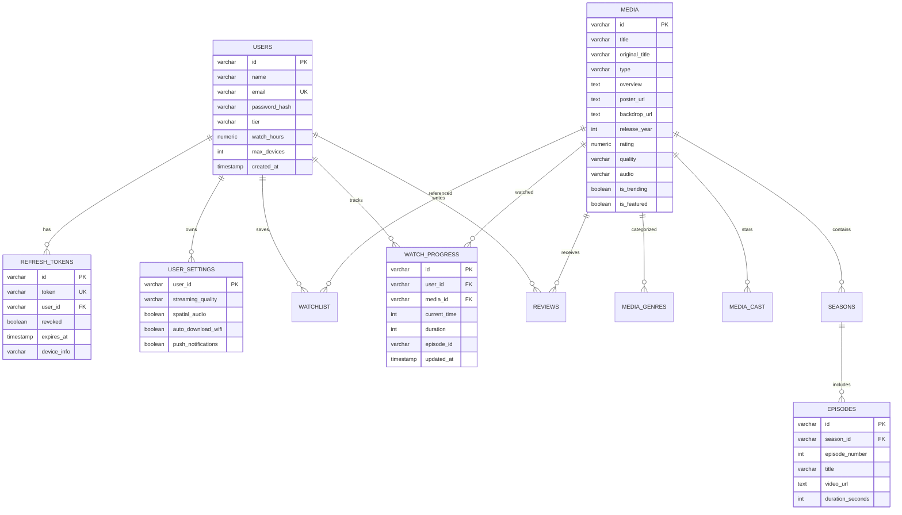

# Dokumentasi Lengkap Backend LiveEuy API

Dokumen teknis arsitektur, database, keamanan, dan spesifikasi REST API untuk layanan backend **LiveEuy**.

---

## 1. Ringkasan Arsitektur & Teknologi

Backend LiveEuy dirancang untuk melayani dua klien secara bersamaan (**Web SPA React** dan **Mobile Flutter**) tanpa duplikasi logika bisnis.

| Komponen | Spesifikasi | Keterangan |
|---|---|---|
| **Runtime & Bahasa** | Java 17 (OpenJDK / Eclipse Temurin) | Long-Term Support (LTS) |
| **Framework** | Spring Boot 3.3.4 | Web MVC, Validation, DevTools |
| **Database** | PostgreSQL 15+ | Relational DB dengan dukungan JSONB dan UUID |
| **Migrasi Database** | Flyway 10.x | Version control skema SQL berurutan |
| **Dokumentasi API** | SpringDoc OpenAPI 2.6.0 | Swagger UI interaktif di `/swagger-ui.html` |
| **Autentikasi** | JWT (HMAC-SHA256) | Access Token stateless + Refresh Token Rotation |
| **Format Pertukaran** | JSON (`application/json`) | Amplop terstandarisasi `ApiResponse<T>` |

---

## 2. Cara Menjalankan Backend

### Prasyarat Sistem
- Java Development Kit (JDK) 17+
- Apache Maven 3.8+ (atau gunakan Docker)
- PostgreSQL 15+ (lokal atau via Docker Compose)

### Menjalankan secara Lokal dengan Maven

1. Masuk ke direktori backend:
   ```bash
   cd C:\Users\user\LiveEuy\backend
   ```
2. Jalankan aplikasi Spring Boot:
   ```bash
   mvn clean spring-boot:run
   ```
3. Server aktif di port `8080` (`http://localhost:8080`).

### Menjalankan dengan Docker Compose

Untuk menjalankan PostgreSQL dan backend secara otomatis dalam kontainer terisolasi:

```bash
cd C:\Users\user\LiveEuy\backend
docker compose up -d
```

### Akses GUI Dokumentasi Interaktif
- **Swagger UI**: [http://localhost:8080/swagger-ui.html](http://localhost:8080/swagger-ui.html)
- **Spesifikasi OpenAPI 3.0 (JSON)**: [http://localhost:8080/api-docs](http://localhost:8080/api-docs)

---

## 3. Struktur Skema Database (PostgreSQL + Flyway)

Skema database dikelola melalui skrip migrasi Flyway di `src/main/resources/db/migration/`:
- `V20260924_01__init_schema.sql`: Skema dasar pengguna, media, genre, aktor, episode, dan ulasan.
- `V20260925_01__create_refresh_tokens_table.sql`: Tabel rotasi refresh token.
- `V20260925_02__auth_and_tokens.sql`: Manajemen sesi perangkat dan pelacakan login.
- `V20260925_02__create_user_settings_table.sql`: Tabel pengaturan streaming dan preferensi pengguna.

### Diagram Relasi Entitas (ERD)



---

## 4. Mekanisme Keamanan & Autentikasi

Backend menerapkan strategi autentikasi ganda untuk mengakomodasi kebutuhan keamanan Web SPA dan Mobile App:

```
[ Web Browser ]  -- (1) POST /login --> [ Spring Boot AuthController ]
                 <-- (2) Access Token (JSON) + Refresh Token (HttpOnly Cookie) --

[ Flutter App ]  -- (1) POST /login --> [ Spring Boot AuthController ]
                 <-- (2) Access Token (JSON) + Refresh Token (JSON Body) --
```

### 1. Perlindungan Web terhadap Serangan XSS & CSRF
- **Access Token**: Disimpan di memori browser (`sessionStorage` atau state) dengan masa kedaluwarsa pendek (15 menit).
- **Refresh Token**: Disimpan di dalam cookie dengan atribut `HttpOnly`, `SameSite=Lax`, dan `Path=/api/v1/auth`. JavaScript di browser tidak memiliki akses baca ke cookie ini, mencegah pencurian kredensial via script injeksi (XSS).

### 2. Rotasi Refresh Token (RTR) & Anti-Replay
- Setiap kali endpoint `POST /api/v1/auth/refresh` dipanggil, refresh token yang digunakan langsung dicabut (`revoked = true`) dan token baru diterbitkan.
- Jika token yang telah dicabut digunakan kembali (indikasi token dicuri pihak ketiga), server otomatis mencabut seluruh token turunan dalam keluarga sesi tersebut.

### 3. Manajemen Multi-Perangkat
- Server mencatat riwayat perangkat aktif (`device_info`, alamat IP, dan waktu akses terakhir).
- Pengguna dapat melakukan pencabutan sesi tertentu via `DELETE /api/v1/auth/devices/{deviceId}` atau mengeluarkan seluruh perangkat via `POST /api/v1/auth/logout-all`.

---

## 5. Standar Amplop Respons API

Semua respons JSON dibungkus menggunakan kelas amplop [`ApiResponse<T>`](file:///C:/Users/user/LiveEuy/backend/src/main/java/com/liveeuy/backend/dto/ApiResponse.java):

```json
{
  "success": true,
  "message": "Deskripsi status operasi",
  "data": { ... },
  "timestamp": 1727514000000
}
```

Format respons error:
```json
{
  "success": false,
  "message": "Alasan penolakan / validasi gagal",
  "data": null,
  "timestamp": 1727514000000
}
```

---

## 6. Daftar Spesifikasi Endpoint REST API

Semua endpoint diawali dengan awalan `/api/v1`.

### A. Modul Autentikasi (`/api/v1/auth`)

#### 1. Login Pengguna
- **Method & URL**: `POST /api/v1/auth/login`
- **Request Body**:
  ```json
  {
    "email": "user@example.com",
    "password": "Password123",
    "rememberMe": true
  }
  ```
- **Response `200 OK`**:
  ```json
  {
    "success": true,
    "message": "Login berhasil. Selamat datang kembali!",
    "data": {
      "accessToken": "eyJhbGciOi...",
      "refreshToken": "7a8b9c...",
      "expiresIn": 900,
      "user": {
        "id": "usr-101",
        "name": "Hafiz Pratama",
        "email": "user@example.com",
        "tier": "VIP Cinema Ultra"
      }
    },
    "timestamp": 1727514000000
  }
  ```
  *Catatan: Pada klien Web, header `Set-Cookie: liveeuy_refresh_token=...; HttpOnly; SameSite=Lax` otomatis disertakan.*

#### 2. Registrasi Akun Baru
- **Method & URL**: `POST /api/v1/auth/register`
- **Request Body**:
  ```json
  {
    "name": "Budi Santoso",
    "email": "budi@example.com",
    "password": "RahasiaNegara123",
    "tier": "VIP Standard"
  }
  ```
- **Response `201 Created`**: Mengembalikan struktur sama dengan login.

#### 3. Refresh Access Token (Silent Refresh)
- **Method & URL**: `POST /api/v1/auth/refresh`
- **Header**: Bawa cookie `liveeuy_refresh_token` (Web) atau sertakan JSON body (Mobile):
  ```json
  {
    "refreshToken": "7a8b9c..."
  }
  ```
- **Response `200 OK`**: Mengembalikan token akses baru dan merotasi cookie refresh token.

#### 4. Logout Sesi Saat Ini
- **Method & URL**: `POST /api/v1/auth/logout`
- **Response `200 OK`**: Menghapus cookie `liveeuy_refresh_token` dan mencabut sesi di database.

#### 5. Logout dari Semua Perangkat
- **Method & URL**: `POST /api/v1/auth/logout-all`
- **Request Body**:
  ```json
  {
    "includeCurrent": true
  }
  ```
- **Response `200 OK`**: Menghapus seluruh token aktif pengguna di semua perangkat.

#### 6. Cabut Sesi Perangkat Tertentu
- **Method & URL**: `DELETE /api/v1/auth/devices/{deviceId}`
- **Response `200 OK`**: Membatalkan akses perangkat target.

#### 7. Profil Pengguna Aktif
- **Method & URL**: `GET /api/v1/auth/me`
- **Header**: `Authorization: Bearer <access_token>`
- **Response `200 OK`**: Data detail akun, membership tier, dan kuota perangkat.

---

### B. Modul Katalog Media & Pencarian (`/api/v1/media`)

#### 1. Ambil Katalog Media (Mendukung Pencarian AJAX)
- **Method & URL**: `GET /api/v1/media`
- **Query Parameters**:
  - `search` (opsional): Kata kunci judul, aktor, atau genre (digunakan oleh fitur Live Search AJAX).
  - `type` (opsional): `'all'`, `'movie'`, atau `'tv'`.
  - `genre` (opsional): Nama kategori genre (misal: `'Aksi'`, `'Horor'`).
  - `country` (opsional): Asal negara (misal: `'Indonesia'`, `'Korea'`).
  - `year` (opsional): Tahun rilis integer (misal: `2026`).
  - `sortBy` (opsional): `'popular'`, `'rating'`, `'newest'`, atau `'oldest'`.
  - `limit` (opsional): Batas jumlah data yang dikembalikan.
- **Response `200 OK`**:
  ```json
  {
    "success": true,
    "message": "Data berhasil dimuat",
    "data": [
      {
        "id": "cyberpunk-neo-nusantara",
        "title": "Cyberpunk: Neo Nusantara",
        "type": "tv",
        "releaseYear": 2026,
        "rating": 9.4,
        "genres": ["Aksi", "Sci-Fi", "Cyberpunk"],
        "posterUrl": "https://images.unsplash.com/...",
        "quality": "4K UHD",
        "audio": "Dolby Atmos"
      }
    ],
    "timestamp": 1727514000000
  }
  ```

#### 2. Detail Media Berdasarkan ID
- **Method & URL**: `GET /api/v1/media/{id}`
- **Response `200 OK`**: Seluruh metadata film/serial, struktur episode per musim, dan ulasan penonton.

#### 3. Sorotan Utama (Featured Carousel)
- **Method & URL**: `GET /api/v1/media/featured`
- **Response `200 OK`**: Daftar tayangan banner hero beranda.

#### 4. Top 10 Paling Populer
- **Method & URL**: `GET /api/v1/media/top-10`
- **Response `200 OK`**: 10 tayangan dengan peringkat penonton tertinggi di Indonesia.

---

### C. Modul Interaksi Pengguna

#### 1. Ulasan & Rating Film
- **Method & URL**: `POST /api/v1/media/{mediaId}/reviews`
- **Request Body**:
  ```json
  {
    "rating": 5.0,
    "comment": "Sinematografi dan CGI 4K sangat memukau!",
    "author": "Hafiz Pratama"
  }
  ```
- **Response `200 OK`**: Entitas ulasan baru yang berhasil disimpan.

#### 2. Daftar Koleksi (Watchlist)
- **Method & URL**: `GET /api/v1/user/watchlist`
- **Response `200 OK`**: Kumpulan string ID media yang tersimpan di koleksi pengguna.

#### 3. Toggle Watchlist (Tambah / Hapus)
- **Method & URL**: `POST /api/v1/user/watchlist/{mediaId}/toggle`
- **Response `200 OK`**:
  ```json
  {
    "success": true,
    "message": "Media ditambahkan ke Koleksi Saya",
    "data": {
      "mediaId": "cyberpunk-neo-nusantara",
      "inWatchlist": true
    }
  }
  ```

#### 4. Sinkronisasi Progres Menonton (Continue Watching)
- **Method & URL**: `GET /api/v1/user/progress`
- **Response `200 OK`**: Map ID media terhadap detik terakhir tontonan.

- **Method & URL**: `PUT /api/v1/user/progress`
- **Request Body**:
  ```json
  {
    "mediaId": "cyberpunk-neo-nusantara",
    "currentTime": 1845,
    "duration": 3600,
    "episodeId": "s02e01"
  }
  ```
- **Response `200 OK`**: Data progres tersimpan.

#### 5. Pengaturan & Preferensi Streaming
- **Method & URL**: `GET /api/v1/user/settings?userId=usr-101`
- **Method & URL**: `PUT /api/v1/user/settings?userId=usr-101`
- **Request Body**:
  ```json
  {
    "streamingQuality": "UHD_4K",
    "spatialAudio": true,
    "autoDownloadWifi": true,
    "pushNotifications": true
  }
  ```

---

## 7. Integrasi dengan Frontend LiveEuy

Frontend React berkomunikasi dengan backend melalui service layer [`src/services/api.ts`](file:///C:/Users/user/LiveEuy/src/services/api.ts):

1. **Variabel Lingkungan Frontend** (`.env`):
   ```env
   VITE_CATALOG_API_URL=http://localhost:8080/api/v1
   VITE_AUTH_API_URL=http://localhost:8080
   ```
2. **Kredensial Cookie**:
   Setiap panggilan fetch dari browser menyertakan opsi `credentials: 'include'` agar browser mengirimkan cookie `HttpOnly` secara otomatis ke domain backend.
3. **Pencarian Live Asinkron**:
   Fitur Live Search pada bilah pencarian menggunakan hook [`useAjaxSearch`](file:///C:/Users/user/LiveEuy/src/hooks/useAjaxSearch.ts) yang mengonsumsi endpoint `GET /api/v1/media?search={query}` dengan jeda debounce 200 ms dan pembatalan otomatis via `AbortController`.
