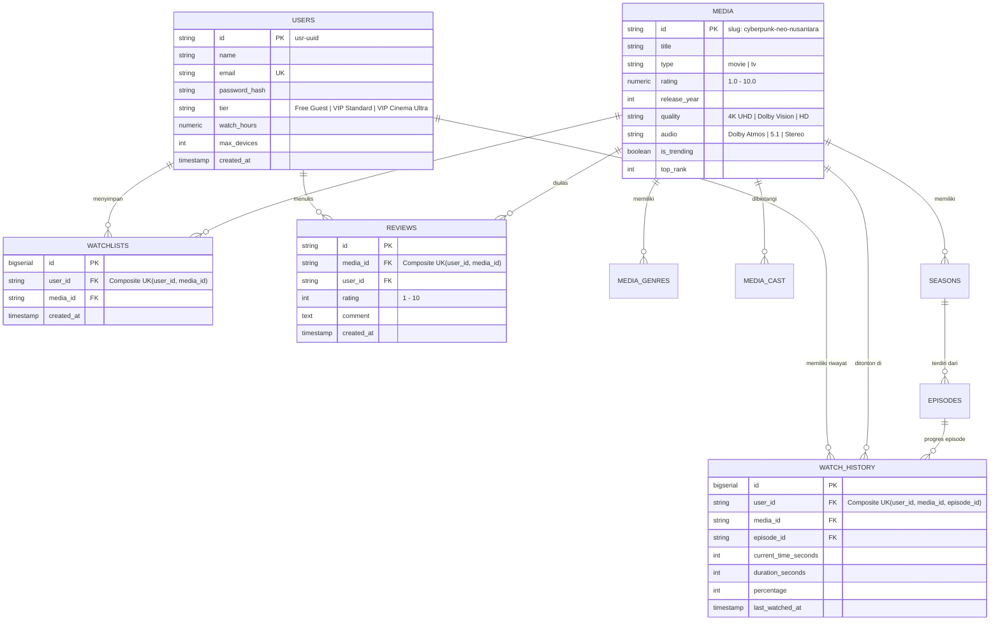

# 🛡️ Panduan Arsitektur & Manajemen Database Tim Backend (Anti-Conflict Database Guidelines)

Dokumen ini adalah **pedoman wajib** bagi seluruh engineer backend LiveEuy untuk menjamin integritas data, mencegah konflik skema saat *merge request/pull request*, mengeliminasi *race conditions*, dan menstandarisasi migrasi database di seluruh lingkungan (*Local*, *Staging*, dan *Production*).

---

## 📌 1. Mengapa Database Tim Sering Bentrok? (Akar Masalah)

Konflik database di tim software biasanya terjadi karena 5 kebiasaan buruk:
1. **Manual DDL Execution**: Developer mengeksekusi `ALTER TABLE` atau `CREATE TABLE` manual di database development bersama tanpa ada pencatatan di Git.
2. **Hibernate `ddl-auto: update`**: Hibernate secara otomatis mengubah tipe kolom, menambah constraint acak, atau mengunci tabel di latar belakang tanpa persetujuan tim.
3. **Tabrakan Nomor Versi Migrasi**: Dua developer sama-sama membuat file `V2__add_media.sql` di branch masing-masing, menyebabkan Flyway *checksum mismatch* atau error saat merge ke `main`.
4. **Race Condition & Duplikasi Data**: Request simultan (misalnya dari aplikasi mobile dan website secara bersamaan saat sync tontonan) membuat data terduplikasi karena tidak adanya *Composite Unique Constraints*.
5. **Shared Remote Dev Database**: Seluruh tim backend menghubungkan aplikasi lokalnya ke satu database remote yang sama, sehingga perubahan schema dari satu orang langsung merusak pekerjaan orang lain.

---

## 🚀 2. Solusi 1: Isolasi Database Lokal (Docker Compose)

> **ATURAN WAJIB**: Setiap developer **WAJIB** menjalankan database PostgreSQL lokal mereka sendiri di mesin masing-masing. Dilarang menggunakan remote database bersama untuk proses coding harian!

Telah disediakan konfigurasi container terisolasi di [`backend/docker-compose.yml`](./docker-compose.yml).

### Cara Menjalankan:
```bash
cd backend
docker compose up -d postgres
```

- **Host**: `localhost`
- **Port**: `5432`
- **Database**: `liveeuy_db`
- **Username**: `liveeuy_user`
- **Password**: `liveeuy_password`

Jika ingin menggunakan GUI Web pgAdmin:
```bash
docker compose up -d
```
Buka browser: `http://localhost:5050` (Email: `admin@liveeuy.id`, Password: `admin`).

---

## 📦 3. Solusi 2: Single Source of Truth dengan Flyway Migration

Skema database tidak dikelola secara manual atau oleh Hibernate, melainkan melalui script SQL versioned di:
📁 `backend/src/main/resources/db/migration/`

### 3.1. Standar Penamaan Script Migrasi (Anti-Tabrakan)

Jangan gunakan penomoran sekuensial sederhana seperti `V1__`, `V2__`, `V3__` karena jika Developer A dan Developer B sama-sama membuat `V3__` di fiturnya masing-masing, saat merge ke `main` akan terjadi tabrakan fatal!

**Format yang Wajib Digunakan**:
```
V{YYYYMMDD_HHMM}__{deskripsi_singkat_snake_case}.sql
```

**Contoh Riwayat yang Benar**:
```
src/main/resources/db/migration/
├── V20260924_01__init_schema.sql             # Skema tabel dasar lengkap
├── V20260925_1030__add_user_phone_number.sql  # Tambah kolom telepon oleh Dev A
├── V20260925_1415__create_coupon_table.sql   # Fitur kupon oleh Dev B
└── R__seed_dev_media.sql                     # Repeatable seed data (hanya dev)
```

### 3.2. Aturan Emas Migrasi Flyway (The Golden Rules)
1. **DILARANG MENGEDIT SCRIPT YANG SUDAH DIMERGE KE `main`**:
   - Flyway menyimpan hash *checksum* SHA-256 dari setiap file SQL di tabel `flyway_schema_history`.
   - Mengubah 1 karakter saja pada file yang sudah ter-deploy akan menyebabkan aplikasi gagal *booting* (`FlywayException: Validate failed: checksum mismatch`).
   - Jika ada kolom yang salah atau ingin diubah, **BUAT SCRIPT MIGRASI BARU** (misal: `V20260926_0900__fix_user_column.sql`).
2. **Script Harus Bersifat Idempotent**:
   - Gunakan `CREATE TABLE IF NOT EXISTS ...`
   - Gunakan `CREATE INDEX IF NOT EXISTS ...`
3. **Pemisahan Migrasi DDL dan Data DML**:
   - File `V...` hanya untuk DDL struktur tabel dan data master penting.
   - Data *dummy* untuk testing lokal ditempatkan di `R__...` atau dimuat via profil Spring `@Profile("dev")`.

---

## ⚙️ 4. Solusi 3: Konfigurasi Spring Boot Bebas Konflik

Pada file `application.yml` (atau `application.properties`), pastikan konfigurasi berikut diterapkan:

```yaml
spring:
  datasource:
    url: jdbc:postgresql://localhost:5432/liveeuy_db
    username: liveeuy_user
    password: liveeuy_password
    driver-class-name: org.postgresql.Driver

  jpa:
    open-in-view: false
    hibernate:
      # PENTING: Wajib 'validate' pada tahap dev & staging.
      # DILARANG MENGGUNAKAN 'update' ATAU 'create-drop'!
      ddl-auto: validate
    properties:
      hibernate:
        format_sql: true
        jdbc:
          batch_size: 25

  flyway:
    enabled: true
    baseline-on-migrate: true
    locations: classpath:db/migration
```

> **Mengapa `ddl-auto: validate`?**
> Karena opsi ini memaksa Hibernate hanya **memvalidasi** apakah struktur class entity Java sudah cocok dengan skema yang dibuat oleh script Flyway. Jika ada ketidaksesuaian tipe data atau kolom yang hilang, Spring Boot akan memberikan pesan error yang jelas sebelum aplikasi aktif, bukan mengubah database secara sepihak.

---

## 📊 5. Entity-Relationship Diagram (ERD LiveEuy)

Berikut relasi tabel yang telah dirancang untuk mendukung fitur frontend LiveEuy (termasuk diferensiasi akun VIP dan mode Tamu):



---

## 🔒 6. Solusi 4: Anti-Race Condition & Idempotent Upsert

### 6.1. Watchlist Toggle Idempotency
Untuk mencegah duplikasi baris saat pengguna menekan tombol *Watchlist* berulang kali secara cepat, tabel `watchlists` menerapkan:
```sql
CONSTRAINT uq_user_media_watchlist UNIQUE (user_id, media_id)
```
Pada Repository Spring Data JPA:
```java
@Modifying
@Query(value = """
    INSERT INTO watchlists (user_id, media_id, created_at)
    VALUES (:userId, :mediaId, CURRENT_TIMESTAMP)
    ON CONFLICT (user_id, media_id) DO NOTHING
""", nativeQuery = true)
void addToWatchlistSafe(@Param("userId") String userId, @Param("mediaId") String mediaId);
```

### 6.2. Watch History Progress Sync (Upsert)
Frontend mengirim progres tontonan setiap 10 detik. Jika beberapa request masuk bersamaan, gunakan pola **UPSERT** agar tidak terjadi deadlock / record ganda:
```sql
INSERT INTO watch_history (
    user_id, media_id, episode_id, current_time_seconds, duration_seconds, percentage, last_watched_at
)
VALUES (
    :userId, :mediaId, :episodeId, :currentTime, :duration, :percentage, CURRENT_TIMESTAMP
)
ON CONFLICT (user_id, media_id, episode_id)
DO UPDATE SET
    current_time_seconds = EXCLUDED.current_time_seconds,
    duration_seconds = EXCLUDED.duration_seconds,
    percentage = EXCLUDED.percentage,
    last_watched_at = CURRENT_TIMESTAMP;
```

---

## 📝 7. Checklist Pull Request (PR) Tim Backend

Sebelum melakukan *Pull Request* atau *Merge* kode yang melibatkan database ke branch utama (`dev-backend` / `main`), pastikan memeriksa poin-poin berikut:

- [ ] **Tidak ada DDL manual**: Seluruh perubahan skema ada di dalam file SQL di folder `src/main/resources/db/migration/`.
- [ ] **Penamaan file migrasi**: Mengikuti format timestamp `VYYYYMMDD_HHMM__deskripsi.sql`.
- [ ] **Tidak mengubah file migrasi lama**: File migrasi yang sudah pernah dimerge tidak boleh diedit isinya.
- [ ] **Hibernate ddl-auto**: Tetap disetel `validate` (bukan `update`).
- [ ] **Foreign Key & Cascade**: Relasi anak (seperti `media_genres`, `media_cast`, `episodes`) memiliki `ON DELETE CASCADE` yang sesuai.
- [ ] **Index pada Kolom Pencarian**: Kolom yang sering difilter (seperti `type`, `release_year`, `rating`, `user_id`) telah diberi indeks.
- [ ] **Uji Migrasi Maju & Mundur**: Aplikasi berhasil dijalankan dari database kosong (`mvn spring-boot:run`) tanpa error migrasi.
- [ ] **Kesesuaian Tipe Data dengan Frontend**: Sesuai dengan spesifikasi [`API_CONTRACT.md`](../API_CONTRACT.md) dan model [`src/types.ts`](../src/types.ts).

---

> Dokumen ini dikelola bersama oleh Tim Engineering LiveEuy. Pertanyaan dan usulan arsitektur database dapat didiskusikan di kanal internal tim.
